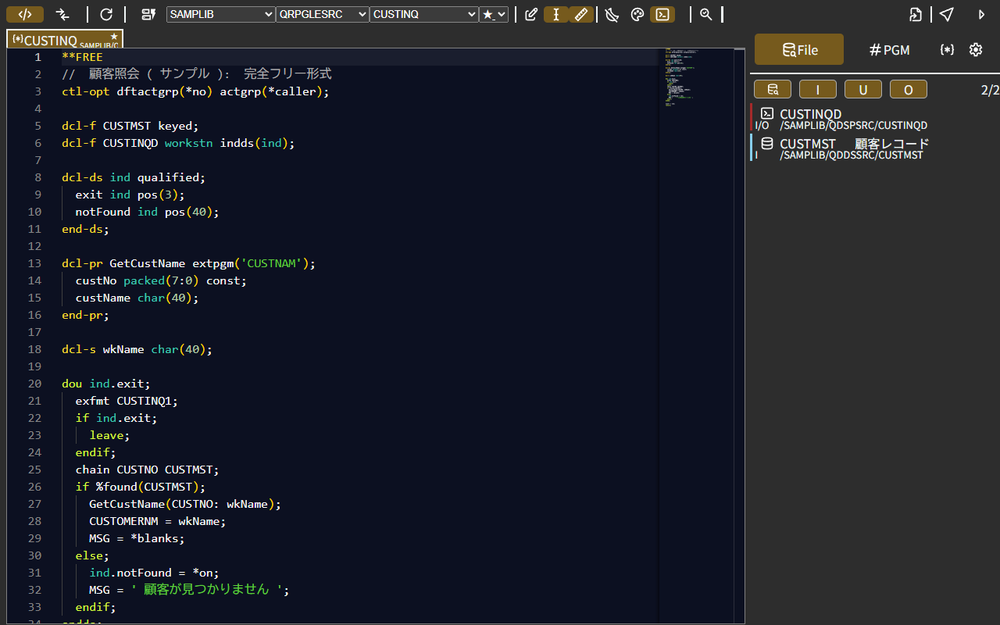
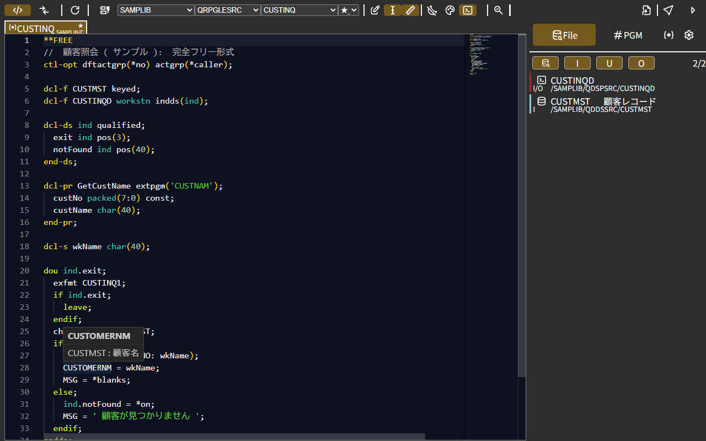
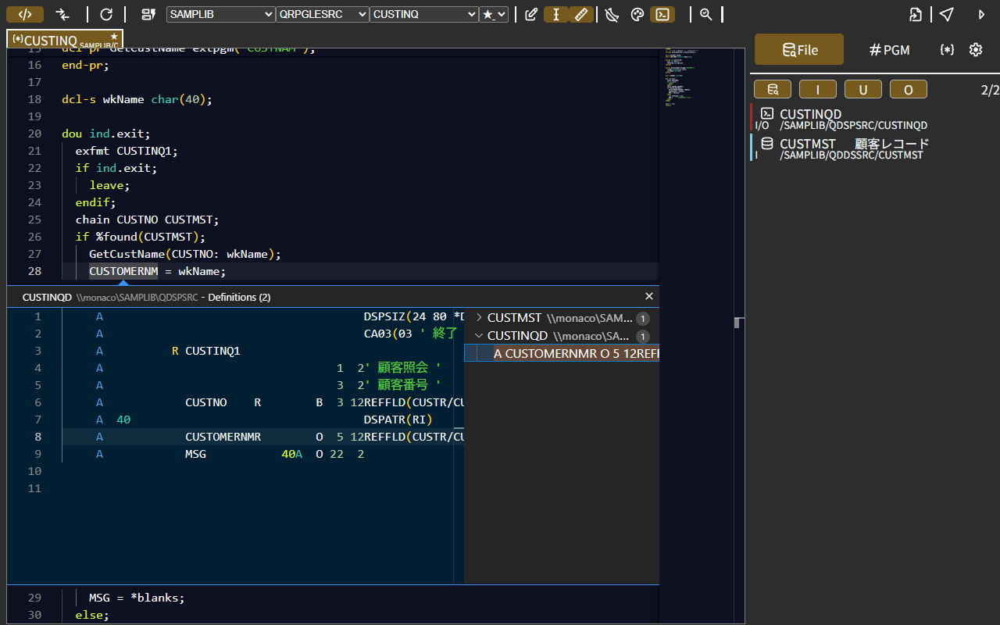
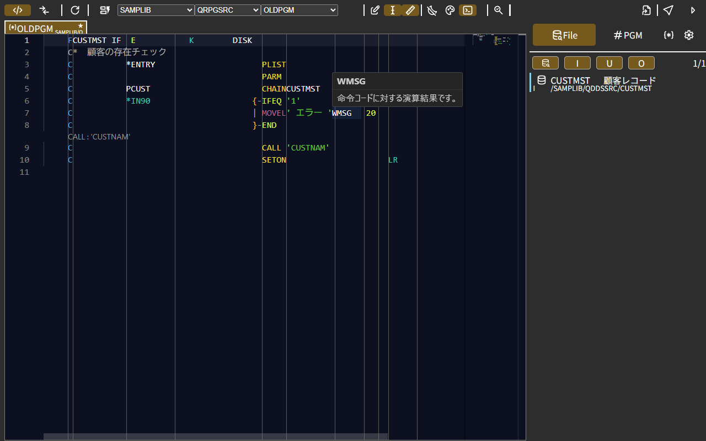
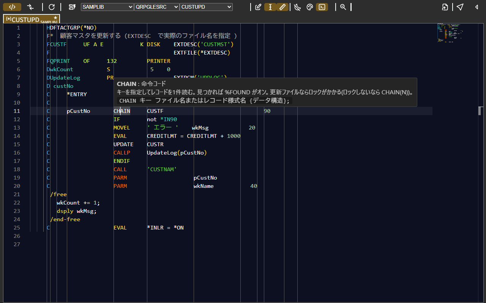
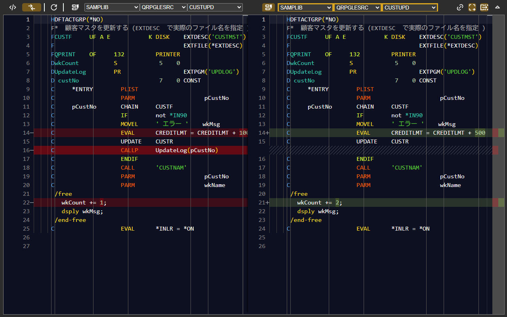
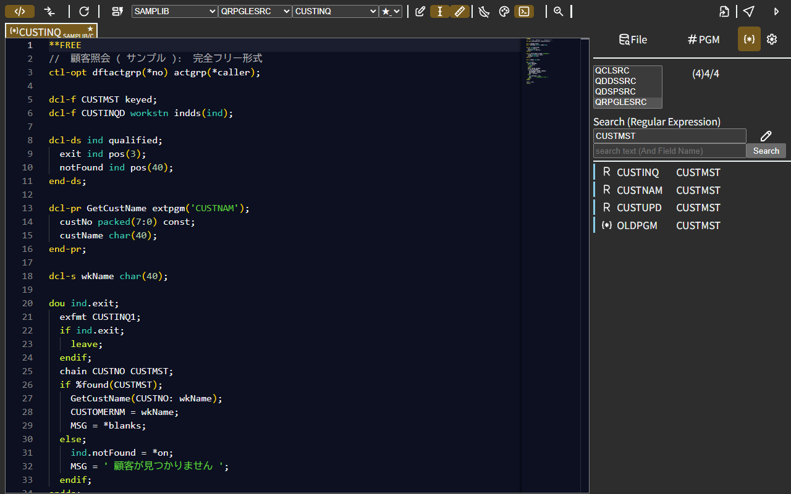
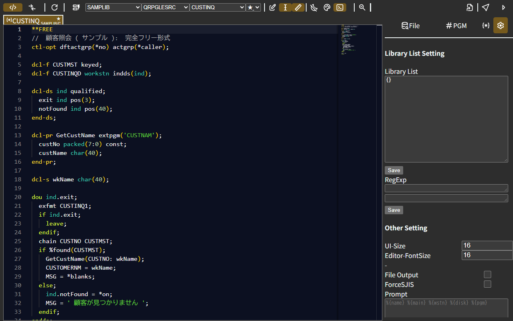
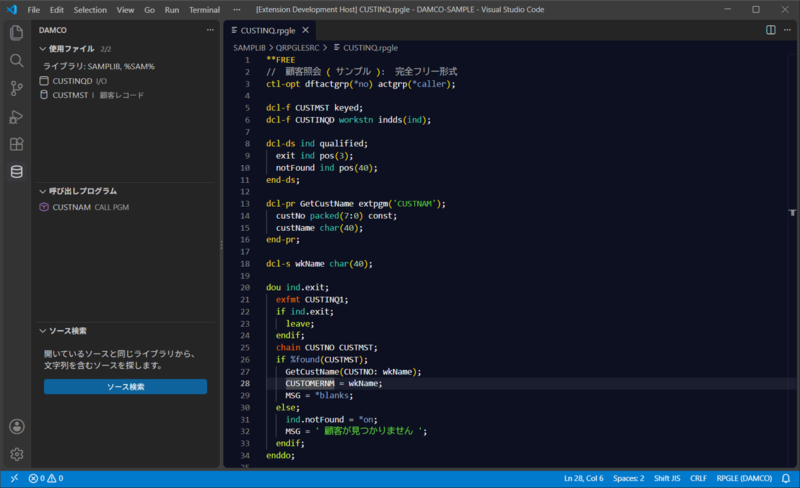

# DAMCO

**IBM i のソース(RPG III / RPGLE / DDS / CL)を、ブラウザだけで読みやすく表示するビューアです。**
インストール不要。パソコンのフォルダに置いたソースを開くだけで、色分け・定義ジャンプ・使っているファイルの一覧・差分表示が使えます。

**▶ [DAMCO を開く](https://tdp-313.github.io/damco/)**(Chrome / Edge)



## 特長

| | |
|---|---|
| **インストール不要** | ブラウザで開くだけ。ソースはブラウザの中で読み、どこにも送りません |
| **桁を意識した色分け** | 仕様書の欄ごとに色分け。全角文字を含む行も IBM i の桁位置どおり |
| **定義へ移動・ホバー** | DDS のフィールドの説明、呼び出し先のプログラム、命令コード・組み込み関数の説明 |
| **使っているファイルの一覧** | ライブラリリストに沿って、使っている DDS・画面・プログラムを自動で探す |
| **RPG III のインデント表示** | IF〜END の構造を線で表示。折りたたみも |
| **差分表示** | 開発と本番(RefMaster)、過去の版と並べて比較 |
| **ソース検索** | ライブラリの中から、文字列を含むソースを探す |
| **VS Code 拡張機能** | 同じ機能を VS Code でも([下記](#vs-code-拡張機能)) |

## 画面

### ホバーと定義へ移動

DDS のフィールドにマウスを置くと説明が、Ctrl+クリックで定義がその場で開きます。

| ホバー | 定義をその場で見る |
|---|---|
|  |  |

### RPG III のインデント表示 / RPGLE の固定形式

| RPG III(構造の線と CodeLens) | RPGLE(仕様書ごとのルーラーと命令コードの説明) |
|---|---|
|  |  |

### 差分表示



### ソース検索・設定

| ソース検索 | 設定 |
|---|---|
|  |  |

## はじめかた

1. IBM i のソースを **ライブラリ / ソースファイル / メンバー** の階層でフォルダに置きます。

   ```
   メイン/
     SAMPLIB/
       QRPGLESRC/
         CUSTINQ.rpgle
       QDDSSRC/
         CUSTMST.pf
   ```

   ソースファイル名(`QRPGSRC` `QRPGLESRC` `QDDSSRC` `QDSPSRC` `QCLSRC`)で種類が決まります。

2. [DAMCO](https://tdp-313.github.io/damco/) を開き、ツールバーの **再読み込みボタンを右クリック** してフォルダを登録します。
3. ライブラリ・ソースファイル・メンバーのプルダウンでソースを選びます。

詳しくは **[使い方ガイド](docs/usage.md)** を見てください。

## ドキュメント

| ドキュメント | 内容 |
|---|---|
| [使い方ガイド](docs/usage.md) | フォルダの用意、ツールバーの各ボタン、サイドバー、差分表示、プロンプト出力、設定、困ったとき |
| [VS Code 拡張機能](docs/vscode.md) | 拡張機能の入れ方・使い方・設定 |

## VS Code 拡張機能

DAMCO の解析処理をそのまま使った VS Code 拡張機能もあります(`extension/`)。VS Code のエディタ・検索・Git の機能と一緒に使えます。IBM i Languages 拡張機能の色分けとも組み合わせられます。



入れ方と使い方は [VS Code 拡張機能のドキュメント](docs/vscode.md) を見てください。

## 動作環境

- Google Chrome / Microsoft Edge(パソコン版)。フォルダを読むために File System Access API を使います。
- ソースの文字コードは UTF-8 / Shift_JIS(自動判定)。

## 開発

```bash
npm install
npm run dev        # 開発用サーバー(http://localhost:5173)
npm run build      # dist/ に公開用のファイルを作り、直下の index.html と assets/ に反映する
npm test           # テスト
```

| フォルダ | 内容 |
|---|---|
| `src/` | Web 版(Vite + Monaco Editor) |
| `shared/` | Web 版と VS Code 拡張機能で共有するロジック |
| `extension/` | VS Code 拡張機能 |
| `docs/` | ドキュメント |

VS Code 拡張機能の VSIX は GitHub Actions(`.github/workflows/vsix.yml`)で作られます。push のたびに Actions の成果物に置かれ、`ext-v0.2.3` のように拡張機能の版のタグを push するとリリースに添付されます。

公開(GitHub Pages)はリポジトリ直下の `index.html` と `assets/` です。`npm run build` で自動的に置き換わる(`assets/` は前のファイルを消してから入れ直す)ので、そのままコミットして main に push すれば公開されます。
