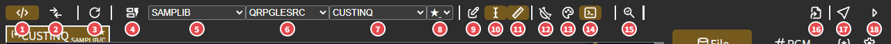
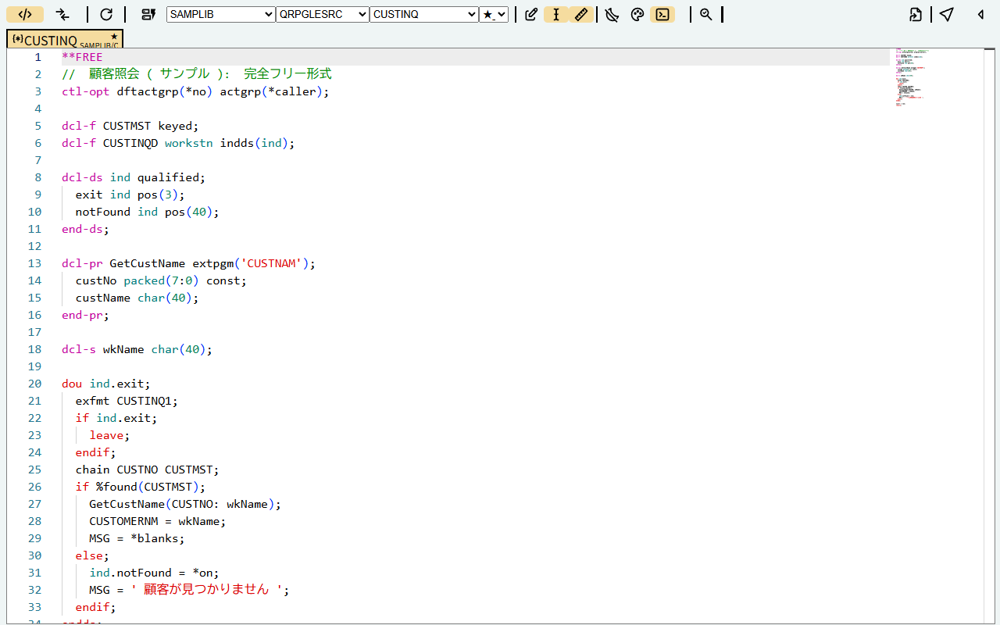
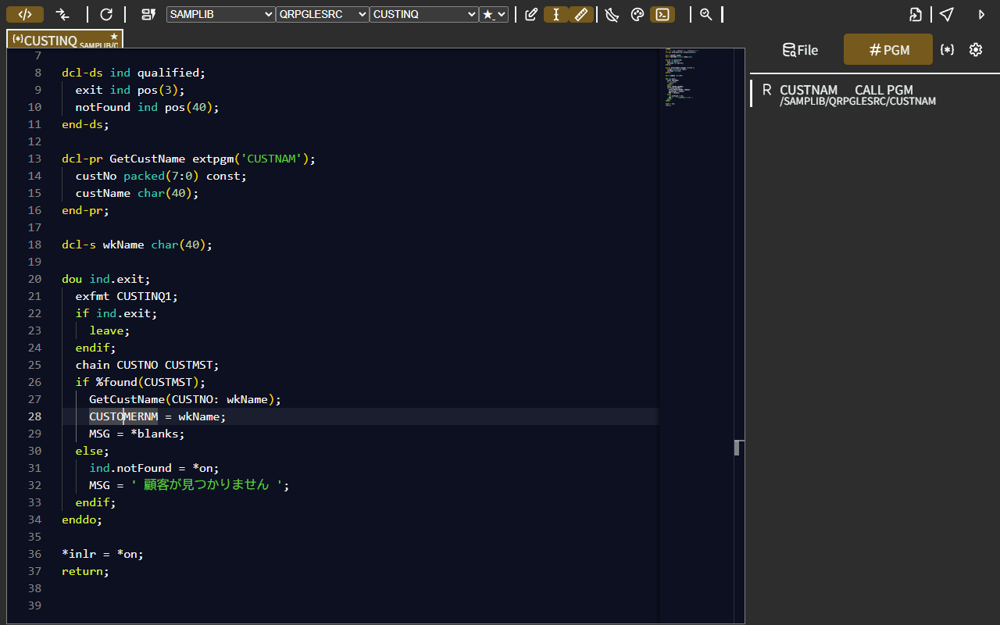
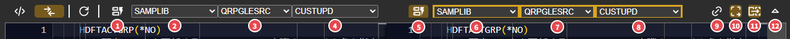

# DAMCO 使い方ガイド(Web 版)

[README に戻る](../README.md) ・ [VS Code 拡張機能](vscode.md)

- [1. 動作環境](#1-動作環境)
- [2. フォルダを用意する](#2-フォルダを用意する)
- [3. はじめて開く(フォルダの登録)](#3-はじめて開くフォルダの登録)
- [4. 画面の見方(ツールバー)](#4-画面の見方ツールバー)
- [5. ソースを開く](#5-ソースを開く)
- [6. ソースを読む](#6-ソースを読む)
- [7. サイドバー](#7-サイドバー)
- [8. 差分表示](#8-差分表示)
- [9. 編集モード](#9-編集モード)
- [10. AI などに渡すテキストを作る(プロンプト出力)](#10-ai-などに渡すテキストを作るプロンプト出力)
- [11. リンク・別のウィンドウで開く](#11-リンク別のウィンドウで開く)
- [12. 設定](#12-設定)
- [13. 参照先の探し方](#13-参照先の探し方)
- [14. 困ったとき](#14-困ったとき)
- [15. キーボード操作](#15-キーボード操作)

---

## 1. 動作環境

| 項目 | 内容 |
|---|---|
| ブラウザ | **Google Chrome / Microsoft Edge(パソコン版)**。フォルダを読むために File System Access API を使うので、Firefox・Safari では動きません |
| インストール | 不要。https://tdp-313.github.io/damco/ を開くだけ。ブラウザのメニューの「アプリをインストール」で、アプリとして起動することもできます |
| 通信 | ソースはブラウザの中で読むだけで、どこにも送りません |

## 2. フォルダを用意する

IBM i のソースを、**ライブラリ / ソースファイル / メンバー** の階層でパソコンのフォルダに置きます(FTP の `mget` や ACS などでダウンロードしたものをそのまま置けます)。

```
メイン/                       ← 1. メインのフォルダ
  SAMPLIB/                    ← ライブラリ
    QRPGLESRC/                ← ソースファイル
      CUSTINQ.rpgle           ← メンバー(拡張子はあってもなくてもよい)
      CUSTUPD.rpgle
    QDDSSRC/
      CUSTMST.pf
    QDSPSRC/
      CUSTINQD.dspf
    QRPGSRC/
      OLDPGM.rpg
メイン履歴/                   ← 2. メインの履歴(なくてもよい)
  SAMPLIB/
    QRPGLESRC/
      CUSTINQ.1               ← メンバー名.番号 = 過去の版
      CUSTINQ.2
RefMaster/                    ← 3. 参照用(本番環境のソースなど。なくてもよい)
  SAMPLIB/ ...
RefMaster履歴/                ← 4. 参照用の履歴(なくてもよい)
```

**ソースファイルの名前で種類が決まります。** 名前にこれらを含むフォルダが、その種類になります(例: `QRPGSRC2` も RPG III)。

| 種類 | ソースファイル名 |
|---|---|
| RPG III | `QRPGSRC` |
| RPGLE(ILE RPG) | `QRPGLESRC` |
| DDS(物理・論理・印刷装置ファイル) | `QDDSSRC` |
| DDS(表示装置ファイル) | `QDSPSRC` |
| CL | `QCLSRC` |

文字コードは UTF-8 と Shift_JIS のどちらでも読めます(自動で判定します。判定がうまくいかないときは [設定](#12-設定) の ForceSJIS)。

## 3. はじめて開く(フォルダの登録)

1. https://tdp-313.github.io/damco/ を開きます。
2. ツールバーの **再読み込み(③)を右クリック** します。
3. 確認が 4 回出るので、登録するものは「OK」を押してフォルダを選びます。

   | 確認の表示 | 選ぶフォルダ |
   |---|---|
   | `Update? FileSystemHandler(main)` | メイン |
   | `Update? FileSystemHandler(main-History)` | メインの履歴 |
   | `Update? FileSystemHandler(RefMaster)` | 参照用 |
   | `Update? FileSystemHandler(RefMaster-History)` | 参照用の履歴 |

4. 選び終わると画面が読み込み直され、ライブラリ・ソースファイル・メンバーのプルダウンが使えるようになります。

登録したフォルダはブラウザに記憶されます。次からは、開いたときに「このサイトにファイルの表示を許可しますか?」と聞かれたら「許可」を押すだけです。
フォルダを変えたいときは、もう一度 再読み込み を右クリックします。

## 4. 画面の見方(ツールバー)



| # | ボタン | 内容 |
|---|---|---|
| 1 | 通常表示 | ソースを 1 つ表示する |
| 2 | 差分表示 | 2 つのソースを並べて比べる([8. 差分表示](#8-差分表示)) |
| 3 | 再読み込み | クリック: 今のソースを読み込み直す。**右クリック: フォルダを登録し直す** |
| 4 | メイン / RefMaster | オンにすると、プルダウンがメインではなく RefMaster(参照用)のフォルダになる |
| 5 | ライブラリ | ライブラリを選ぶ |
| 6 | ソースファイル | ソースファイルを選ぶ |
| 7 | メンバー | メンバーを選ぶ(先頭 2 文字ごとにグループ分けされる) |
| 8 | 版 | 履歴のフォルダに過去の版があるとき出る。`★` が今の版 |
| 9 | 編集 | オンにすると画面上で編集できる([9. 編集モード](#9-編集モード)) |
| 10 | 挿入 / 上書き | 編集モードでの入力の方法(Insert キーでも切り替え) |
| 11 | ルーラー | 桁の区切り線を出す |
| 12 | スリープ防止 | 表示している間、画面が消えないようにする |
| 13 | テーマ | ダーク / ライトを切り替える |
| 14 | 起動時に読み込む | オンにすると、開いたときに登録したフォルダを読み込む(オフなら ①・③ を押したときに読み込む) |
| 15 | 参照先の検索の状態 | 参照先(使っているファイル)を探している途中 / 終わり を表す。クリックで RefMaster のメンバーを名前で開く(右クリックは `ライブラリ/ソースファイル/メンバー` で指定) |
| 16 | プロンプト出力 | クリック: 今のソースと参照先からテキストを作ってコピー。右クリック: 今の表示のリンクをコピー([10](#10-ai-などに渡すテキストを作るプロンプト出力)・[11](#11-リンク別のウィンドウで開く)) |
| 17 | タブに追加 | クリック: 今のソースを別のタブとして残す。右クリック: 別のウィンドウで開く |
| 18 | サイドバー | 右のサイドバーを開く・閉じる |

## 5. ソースを開く


- プルダウン(⑤ライブラリ → ⑥ソースファイル → ⑦メンバー)を選ぶと開きます。ライブラリやソースファイルを変えると、先頭 3 文字が同じものが自動で選ばれます。
- **タブ**: プルダウンで開いたソースは `★` のタブに入れ替わりで表示されます。残しておきたいソースは ⑰ で別のタブにします。サイドバーの一覧や検索結果から開いたソースも別のタブになります。タブの × で閉じます。
- **過去の版**: 履歴のフォルダに `メンバー名.番号` のファイルがあると、⑧ のプルダウンに版の番号と日時が出て、選ぶとその版を開けます。
- **RefMaster のソース**: ④ をオンにすると、RefMaster のフォルダのライブラリ・ソースファイル・メンバーを選べます。

## 6. ソースを読む

### 色分け

RPG III・RPGLE(固定形式・`/FREE`・`**FREE`)・DDS・CL を、仕様書の欄ごとに色分けします。全角文字を含む行も、IBM i の桁位置(全角 = 2 桁)どおりに色分けします。
⑬ でライトテーマにもできます。



### ホバー

名前にマウスを置くと説明が出ます。

- DDS のフィールド: どのファイルのフィールドか、TEXT / COLHDG の説明
- 命令コード・キーワード・組み込み関数・特殊値・固定形式の欄の意味(RPGLE)
- 欄の意味(RPG III・DDS)


ソースの中で自分で定義した名前には、ホバーは出ません(定義へ移動で見られるため)。

### 定義へ移動・参照

| 操作 | 内容 |
|---|---|
| Ctrl+クリック / Alt+F12 | 定義をその場で開く(ピーク表示)。DDS のフィールド・ファイル、呼び出し先のプログラム、ソース内の定義 |
| Shift+F12 | その名前を使っている場所の一覧 |

DDS のフィールドは、そのフィールドを定義しているすべてのファイルが候補に出ます。


### RPG III

RPG III は、IF〜END などの構造を線で表した **インデント表示** で開きます。

- `{` `}` `|` が構造の線です。IF / DO などの範囲は折りたためます。
- CALL・BEGSR・DO の行の上に、呼び出し先などの見出し(CodeLens)が出ます。
- 全角の文字定数の右の欄(結果フィールドなど)も、ホバー・定義・参照が正しく動きます。


### RPGLE の固定形式

カーソルのある行の仕様書(H / F / D / P / I / C / O)に合わせて、ルーラー(⑪)が欄の区切りに切り替わります。命令コードなどにマウスを置くと、説明と書き方が出ます。


## 7. サイドバー

⑱ で開きます。上のボタンで内容を切り替えます。

| ボタン | 内容 |
|---|---|
| File | 開いているソースが使っているファイル(画面・DDS)。使い方(I / U / O)と説明。見つからなければ「Not Found」 |
| PGM | 呼び出しているプログラム |
| `{*}` | ソース検索 |
| 歯車 | 設定 |

一覧の項目をクリックすると、そのソースが別のタブで開きます。

### File(使っているファイル)

左の線の色は使い方です(茶: 出力あり、黄緑: 更新、水色: 入力のみ)。上のボタンで絞り込めます。

| ボタン | 内容 |
|---|---|
| 虫めがね | 論理ファイルの元の物理ファイル(PFILE)も出す |
| I / U / O | 入力・更新・出力で使っているものを出す |
| 右の数字 | 出している数 / 全部の数 |

### PGM(呼び出しているプログラム)



### ソース検索

開いているソースと同じライブラリから、文字列を含むソースを探します。

1. 探すソースファイルを選ぶ(Ctrl+クリックで複数選べます)
2. 検索語を入れて「Search」(または Enter)
   - 1 つ目の欄: ファイル名やフィールド名など
   - 2 つ目の欄: さらに絞り込む語(両方を含むものだけ)
3. 結果をクリックすると、そのソースが開いて、検索語が検索欄に入った状態になります

検索語は正規表現です。`%` を含むときは、`%` = 任意の文字列、`_` = 任意の 1 文字になります(例: `%found(CUST%`)。
鉛筆のボタンで、結果をタブ区切りでコピーできます(Excel などに貼れます)。


## 8. 差分表示

② で差分表示にします。左右それぞれでライブラリ・ソースファイル・メンバーを選ぶと、違うところが色付きで出ます。メインと RefMaster(本番)を比べる、過去の版と比べる、といった使い方ができます。




| # | ボタン | 内容 |
|---|---|---|
| 1・5 | メイン / RefMaster | 左・右それぞれのフォルダを切り替える |
| 2〜4・6〜8 | ライブラリ・ソースファイル・メンバー | 左・右それぞれのソース |
| 9 | 連動 | オンのとき、片方でソースファイル・メンバーを選ぶともう片方も同じものを選ぶ |
| 10 | インデント | RPG III をインデント表示で比べる(オフなら元のテキスト) |
| 11 | 並べて表示 | 左右に並べる / 1 つにまとめる。右クリックで別のウィンドウで開く |
| 12 | ツールバー | 右側のボタン(編集・テーマなど)の表示を切り替える |

## 9. 編集モード

⑨ をオンにすると、画面上でソースを書き換えられます(**ファイルには保存されません**。プロンプト出力の前に手直しする、などに使います)。

- ⑩ または Insert キーで、挿入と上書きを切り替えます(上書きのときはカーソルが四角になります)。
- Enter で、空白の行を次に入れます。
- RPG III で行を足したあとは、右クリックのメニューの「再インデント処理」で構造の線を引き直せます。

## 10. AI などに渡すテキストを作る(プロンプト出力)

⑯ を押すと、開いているソースと、そのソースが使っているファイル・プログラムの中身から、テキストを作ってクリップボードにコピーします(設定の「File Output」がオンならファイルに保存)。
テキストのひな形は、サイドバーの設定の「Prompt」に書きます。次の文字が置き換わります。

| 書き方 | 置き換わる内容 |
|---|---|
| `%{name}` | メンバー名 |
| `%{main}` | 開いているソース(インデント表示の線を除いたもの) |
| `%{disk}` | 使っている DDS のファイル(`{"ファイル名": "中身"}` の形。見つからなければ `N/A`) |
| `%{wstn}` | 使っている表示装置ファイル(同上) |
| `%{pgm}` | 呼び出しているプログラム(同上) |

例:

```
次の RPG プログラム %{name} の処理を説明してください。
--- ソース ---
%{main}
--- 使っているファイル ---
%{disk}
%{wstn}
```

## 11. リンク・別のウィンドウで開く

- ⑯ を **右クリック** すると、今表示しているソースのリンクをコピーします。リンクを開くと、同じライブラリ・ソースファイル・メンバー(差分表示なら左右とも)が開きます。
- ⑰ を **右クリック** すると、今のソースを別のウィンドウで開きます。
- アプリとしてインストールした場合は、アイコンの右クリックメニューから「Normal Viewer」(通常表示)・「Diff Viewer」(差分表示)で起動できます。

リンクの形: `https://tdp-313.github.io/damco/?init=code&prevView={"root":"monaco","lib":"SAMPLIB","folder":"QRPGLESRC","file":"CUSTINQ"}`
(`init=diff` のときは `prevView` に `left` と `right` を書きます)

## 12. 設定

サイドバーの歯車で開きます。項目ごとに「Save」を押すと保存されます(ブラウザに記憶されます)。


| 項目 | 内容 |
|---|---|
| Library List | ライブラリごとのライブラリリスト(参照先を探すライブラリ)。JSON で書きます。例: `{"SAMPLIB": ["SAMPLIB", "COMLIB", "PRD%"]}`。書かなかったライブラリは「そのライブラリ」と「先頭 3 文字を含むライブラリ」を探します |
| RegExp | 参照先が完全一致で見つからないときの部分一致。1 行目で探す名前を分割し(正規表現)、2 行目の `${strA[0]}` `${strA[1]}` … に分割した結果を入れてメンバー名と比べます。例: 1 行目 `^(.{6})`、2 行目 `^${strA[1]}` で「先頭 6 文字が同じメンバー」 |
| UI-Size | ツールバー・サイドバーの文字の大きさ |
| Editor-FontSize | ソースの文字の大きさ(Ctrl+マウスホイールでも変えられます) |
| File Output | オンにすると、プロンプト出力をクリップボードではなくファイル(`メンバー名_日時.txt`)に保存する |
| ForceSJIS | オンにすると、すべてのソースを Shift_JIS として読む |
| Prompt | プロンプト出力のひな形([10](#10-ai-などに渡すテキストを作るプロンプト出力)) |

ライブラリリストの `%` は、`COM%`(前方一致)・`%LIB`(後方一致)・`%DEV%`(部分一致)が使えます。

## 13. 参照先の探し方

ソースを開くと、次の順で参照先(使っているファイル・呼び出しているプログラム)を探し、サイドバー・ホバー・定義へ移動に使います。探している間は ⑮ のアイコンが変わります。

1. **探すフォルダ**: メインのソースならメインと RefMaster、RefMaster のソースなら RefMaster
2. **探すライブラリ**: 設定のライブラリリスト。なければ「そのライブラリ」と「先頭 3 文字を含むライブラリ」
3. **探すソースファイル**: DDS は `QDDSSRC`・`QDSPSRC`、プログラムは `QRPGSRC`・`QRPGLESRC`・`QCLSRC` を名前に含むもの
4. **メンバー**: 名前が一致するもの。なければ設定の RegExp で部分一致
5. **論理ファイル**: 見つかった論理ファイルの PFILE(元の物理ファイル)も探す

同じメンバーが複数のライブラリにあるときは、フォルダの並び順で先に見つかったものを使います。

## 14. 困ったとき

| 症状 | 確認すること |
|---|---|
| フォルダを選ぶ画面が出ない | Chrome / Edge のパソコン版か。再読み込み(③)の右クリックから登録する |
| 開くたびに許可を聞かれる | ブラウザの仕様です。「許可」を押してください(サイトの設定で「毎回許可」にできる場合があります) |
| プルダウンが空 | 登録したフォルダが「ライブラリ / ソースファイル / メンバー」の階層になっているか |
| 日本語が文字化けする | 設定の ForceSJIS をオンにする |
| 色分けされない・種類が違う | ソースファイルの名前に `QRPGSRC` などが入っているか(入っていないものは DDS として表示されます) |
| 使っているファイルが「Not Found」 | 設定のライブラリリストに、そのファイルのあるライブラリが入っているか。ソースファイルの名前が `QDDSSRC` などを含むか |
| 新しいファイルが出てこない | 再読み込み(③)をクリック |
| 動きがおかしい | Shift+F5 でキャッシュを使わずに読み込み直す |

## 15. キーボード操作

エディタは VS Code と同じ Monaco Editor なので、主な操作は VS Code と同じです。

| キー | 内容 |
|---|---|
| Ctrl+F | 検索 |
| Ctrl+クリック / Alt+F12 | 定義をその場で見る |
| Shift+F12 | 参照の一覧 |
| Ctrl+Shift+[ / ] | 折りたたむ / 開く |
| Alt+クリック、Shift+Alt+ドラッグ | 複数カーソル、矩形選択(固定形式の欄を選ぶのに便利) |
| Ctrl+マウスホイール | 文字の大きさ |
| F1 | コマンドの一覧 |
| Insert | 挿入 / 上書き(編集モード) |
