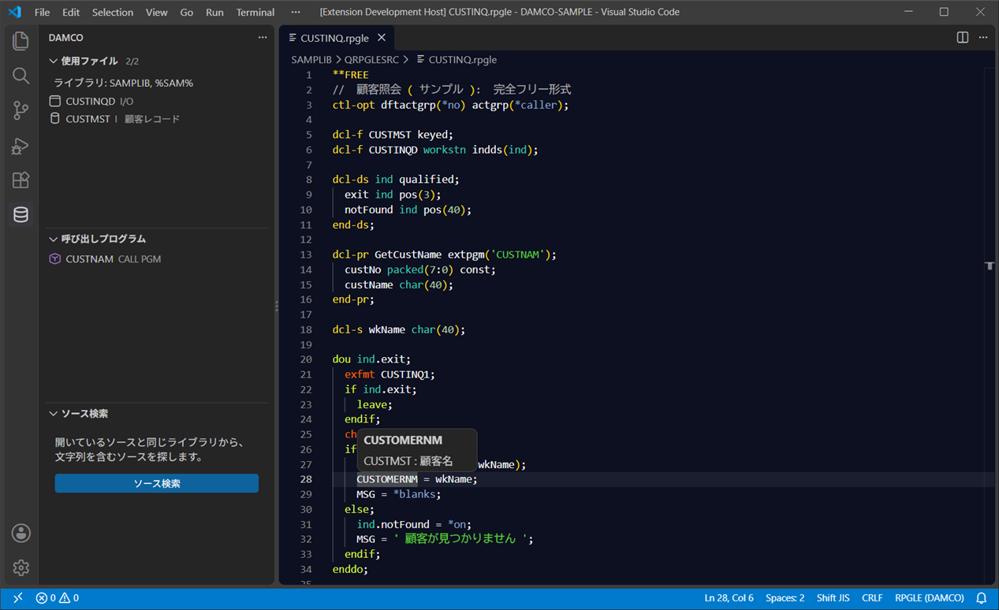
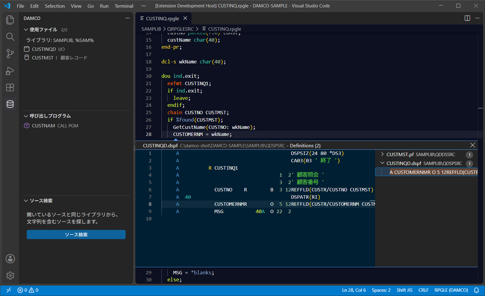
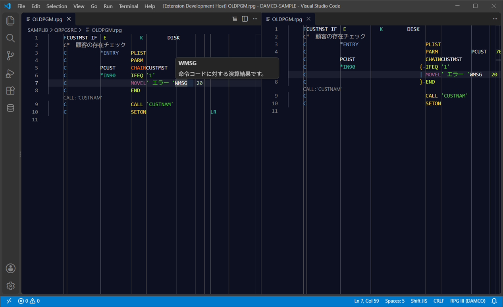
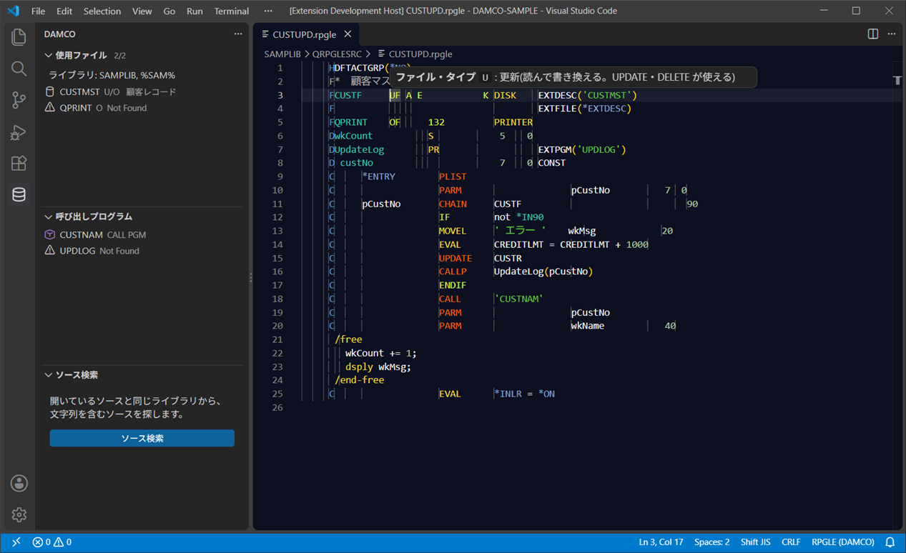
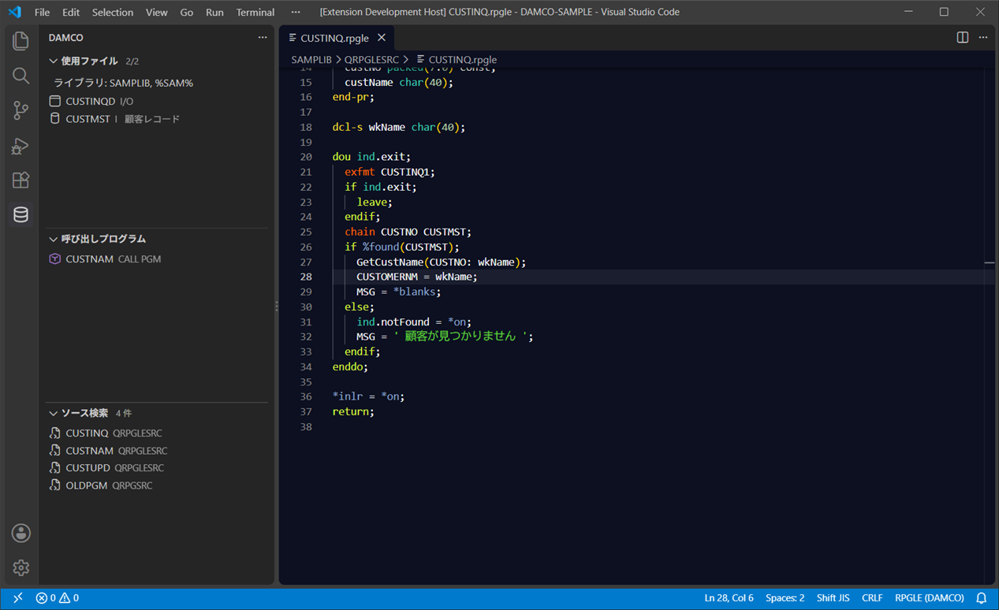
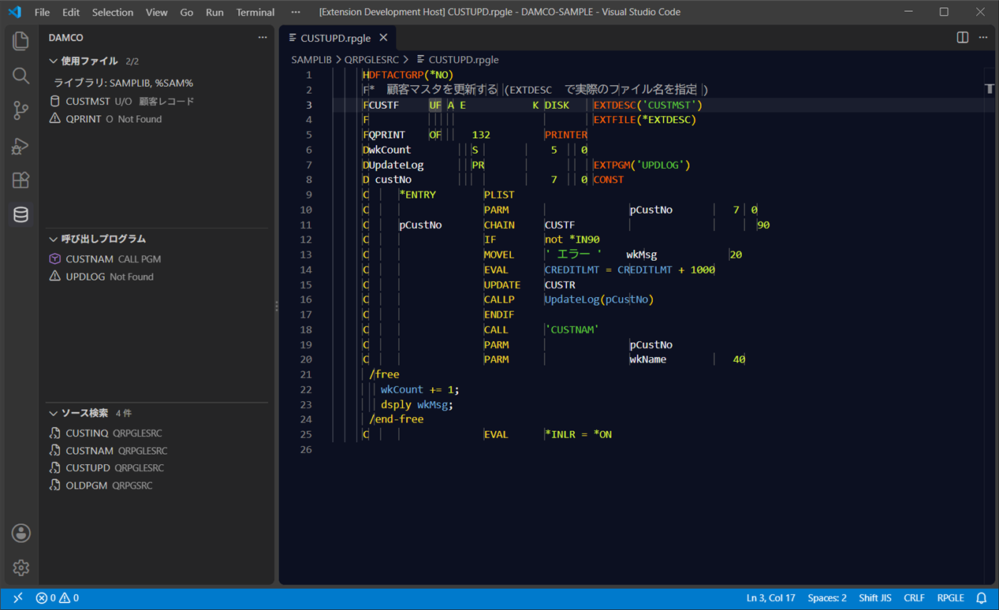
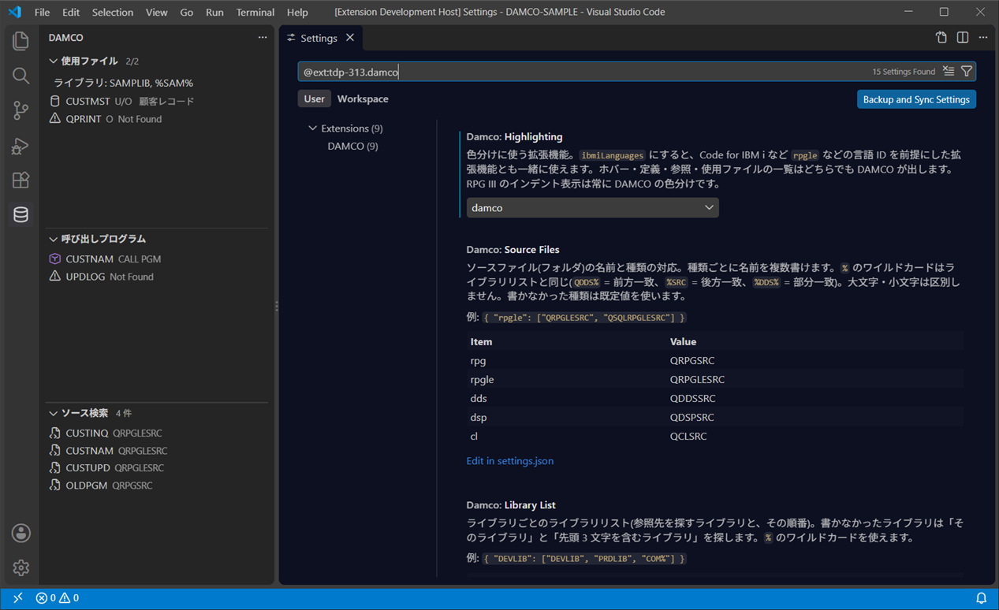

# DAMCO for VS Code

IBM i のソース(RPG III / RPGLE / DDS / CL)を VS Code で読むための拡張機能です。
Web 版 DAMCO の解析処理をそのまま使っているので、色分け・ホバー・定義ジャンプ・使用ファイルの一覧は Web 版と同じ結果になります。


- [主な機能](#主な機能)
- [インストール](#インストール)
- [はじめかた](#はじめかた)
- [機能の紹介](#機能の紹介)
- [設定](#設定)
- [参照先の探し方](#参照先の探し方)
- [困ったとき](#困ったとき)
- [Web 版との違い・制限](#web-版との違い制限)
- [開発](#開発)

## 主な機能

| 機能 | 内容 |
|---|---|
| 色分け | Web 版と同じ規則。テーマ「DAMCO Dark」「DAMCO Light」なら色も Web 版と同じ。IBM i Languages の色分けにも切り替えられます |
| ホバー | 命令コード・キーワード・組み込み関数・欄の説明、DDS のフィールドの説明(TEXT / COLHDG) |
| 定義へ移動・参照 | ソース内の定義、DDS のフィールド・ファイル、呼び出し先のプログラム |
| 使用ファイル・呼び出しプログラム | 開いているソースが使っているファイル(I/U/O つき)と呼び出しているプログラムの一覧 |
| RPG III のインデント表示 | Web 版の通常表示と同じ、構造の線が入った表示(読み取り専用) |
| 欄の区切り線 | RPG III は固定のルーラー、RPGLE は行ごとにその行の仕様書の欄 |
| ソース検索 | 同じライブラリのソースから、文字列(正規表現・`%` のワイルドカード)を含むものを探す |
| 文字コード | Web 版と同じ判定で、Shift_JIS のファイルは Shift_JIS で開き直す |

**他の拡張機能は必要ありません。** IBM i Languages(barrettotte.ibmi-languages)が入っていれば、色分けだけをそちらに任せることもできます([色分けとテーマ](#色分けとテーマ))。

## インストール

必要なもの: VS Code 1.101 以降

1. `damco-x.x.x.vsix` を用意します。
2. VS Code の拡張機能ビュー(Ctrl+Shift+X)の右上の「…」→「VSIX からのインストール...」で選びます。
   コマンドで入れる場合:
   ```
   code --install-extension damco-0.2.0.vsix
   ```
3. 新しい版を入れたときは、Ctrl+Shift+P →「Developer: Reload Window」でウィンドウを読み込み直してください。拡張機能ビューの DAMCO の版で、入っている版を確かめられます。

## はじめかた

### フォルダの構成

Web 版と同じく、ルートのフォルダを VS Code で開きます(ファイル → フォルダーを開く)。

```
ルート/                     ← このフォルダを開く
  SAMPLIB/                  ← ライブラリ
    QRPGLESRC/              ← ソースファイル(名前で種類が決まる)
      CUSTINQ.rpgle         ← メンバー(拡張子はあってもなくてもよい)
    QDDSSRC/
      CUSTMST.pf
    QDSPSRC/
      CUSTINQD.dspf
  PRDLIB/
    ...
```

ソースファイルの名前と種類の対応(既定値。[設定](#設定)で変えられます)

| 種類 | ソースファイル名 |
|---|---|
| RPG III | `QRPGSRC` |
| RPGLE | `QRPGLESRC` |
| DDS(物理・論理・印刷) | `QDDSSRC` |
| DDS(表示装置) | `QDSPSRC` |
| CL | `QCLSRC` |

### 使い方の流れ

1. メンバーを開くと、ソースファイルの名前から言語が決まり、色分けされます(ステータスバーの右下に `RPGLE (DAMCO)` などと出ます)。
2. 左のアクティビティバーの DAMCO のアイコン(円柱)で、使っているファイルと呼び出しているプログラムの一覧が出ます。
3. 名前の上で F12 を押すと、DDS のフィールドや呼び出し先のプログラムへ移動します。

## 機能の紹介

### ホバー

名前の上にマウスを置くと、DDS のフィールドの説明(どのファイルのフィールドか、TEXT / COLHDG)が出ます。命令コード・キーワード・組み込み関数・特殊値・固定形式の欄にも説明が出ます。



ソースの中で自分で定義した名前には、ホバーは出しません(定義へ移動で見られるため。Web 版と同じ)。

### 定義へ移動・参照

| 操作 | キー |
|---|---|
| 定義へ移動 | F12、または Ctrl+クリック |
| 定義をその場で見る | Alt+F12 |
| 参照の一覧 | Shift+F12 |

DDS のフィールドは、そのフィールドを定義しているすべてのファイル(物理ファイル・表示装置ファイル)が候補に出ます。



### 使用ファイル・呼び出しプログラム

アクティビティバーの DAMCO を開くと、開いているソースについて次の一覧が出ます。項目をクリックするとそのファイルを開きます。

| 一覧 | 内容 |
|---|---|
| 使用ファイル | 表示装置ファイル・DDS のファイルと、使い方(I / U / O、I/O、U/O)、説明(TEXT)。見つからなければ「Not Found」 |
| 呼び出しプログラム | CALL / CALLP などで呼び出しているプログラム |
| ソース検索 | 下の「ソース検索」の結果 |

- 一覧の上の「ライブラリ: …」が、参照先を探したライブラリ(ライブラリリスト)です。
- 使用ファイルの右上のボタンで、I / U / O や論理ファイルの元の物理ファイル(PFILE)の絞り込み、探し直しができます。
- 設定など、ソース以外のタブに切り替えても、直前のソースの一覧が残ります。

### RPG III: 元のファイルとインデント表示

RPG III のファイルを開いたまま、ホバー・定義・参照・折りたたみ・CodeLens(CALL・BEGSR などの表示)が使えます。
エディタ右上の「インデント表示で開く」(またはコマンド「DAMCO: インデント表示で開く」)で、Web 版の通常表示と同じインデント表示を開けます(読み取り専用。元のファイルを編集すると自動で更新されます)。



インデント表示から元のファイルへは、右上の「元のファイルを開く」で戻れます。

### RPGLE の固定形式

固定形式の行には、その行の仕様書(H / F / D / P / I / C / O)の欄の区切り線を引きます。欄の上にマウスを置くと、その欄の意味が出ます。
`/free` 〜 `/end-free` や完全フリー形式(`**FREE`)の行も、同じファイルの中で色分け・解析されます。



### ソース検索

開いているソースと同じライブラリの中から、文字列を含むソースを探します(Web 版のサイドバーの検索と同じ)。

1. ソース検索の一覧の「ソース検索」ボタン(またはコマンド「DAMCO: ソース検索」)
2. 探すソースファイルを選ぶ(複数選べます)
3. 検索語を入れる。2 つ目の検索語を入れると、両方を含むものだけ(AND)

検索語は正規表現です。`%` を含むときは、`%` = 任意の文字列、`_` = 任意の 1 文字になります(例: `%found(CUST%`)。
結果は一覧に出て、クリックで開けます。右上のボタンで、結果をタブ区切りでクリップボードにコピーできます。



### 色分けとテーマ

設定 `damco.highlighting` で、色分けに使う拡張機能を選べます。

| 値 | 動作 |
|---|---|
| `auto`(既定) | IBM i Languages が入っていればそれを、なければ DAMCO を使う |
| `damco` | DAMCO の色分け。言語は `RPGLE (DAMCO)` などになる |
| `ibmiLanguages` | IBM i Languages の色分け。言語は `rpg` `rpgle` `cl` `dds.pf` `dds.dspf` になる |

- **IBM i Languages がなくても、DAMCO の色分けで全部の機能が使えます。** `ibmiLanguages` を選んでいても入っていなければ、DAMCO の色分けになります。
- `ibmiLanguages` では、メンバーの拡張子が `.txt` などでも、ソースファイルの名前で言語が決まります。Code for IBM i など `rpgle` などの言語を前提にした拡張機能とも一緒に使えます。
- どちらでも、ホバー・定義・参照・使用ファイルの一覧は DAMCO が出します。ライブラリの階層の外にある `.rpgle` などには DAMCO は答えません(他の拡張機能に任せます)。
- RPG III のインデント表示は、常に DAMCO の色分けです。



DAMCO の色分けで Web 版と同じ色にするには、テーマ(Ctrl+K → Ctrl+T)で「DAMCO Dark」または「DAMCO Light」を選びます。ほかのテーマでも、テーマに合わせた色で色分けされます。

## 設定

設定画面(Ctrl+,)で `@ext:tdp-313.damco` と検索すると、DAMCO の設定が一覧で出ます。
ワークスペースの `.vscode/settings.json` に書くと、チームで同じ設定を使えます。



| 設定 | 既定値 | 内容 |
|---|---|---|
| `damco.highlighting` | `auto` | 色分けに使う拡張機能([色分けとテーマ](#色分けとテーマ)) |
| `damco.sourceFiles` | 上の表の 5 つ | ソースファイルの名前と種類 |
| `damco.libraryList` | `{}` | ライブラリごとのライブラリリスト |
| `damco.referenceRoots` | `[]` | 参照先を探す追加のルートフォルダ(Web 版の RefMaster) |
| `damco.regExp.split` / `damco.regExp.search` | `""` | 完全一致で見つからないときの部分一致(Web 版の RegExp) |
| `damco.autoDetectEncoding` | `true` | Shift_JIS のファイルを Shift_JIS で開き直す |
| `damco.forceShiftJIS` | `false` | 常に Shift_JIS として読む(Web 版の ForceSJIS) |
| `damco.rulers.rpgle` | `true` | RPGLE の欄の区切り線 |

### 設定の例

```jsonc
{
  // ソースファイルの名前。書いた種類だけ置き換わり、残りは既定値のまま
  // % は前方一致(QDDS%)・後方一致(%SRC)・部分一致(%DDS%)。大文字・小文字は区別しない
  "damco.sourceFiles": {
    "rpgle": ["QRPGLESRC", "QSQLRPGLESRC"],
    "dds": ["QDDSSRC", "QDDS%"]
  },

  // ライブラリごとのライブラリリスト。この順に探し、同じメンバーは前の方を使う
  "damco.libraryList": {
    "DEVLIB": ["DEVLIB", "PRDLIB", "COM%"]
  },

  // 参照用のルート。ライブラリのフォルダが並んでいるフォルダ(相対パスは最初のワークスペースフォルダから)
  "damco.referenceRoots": ["C:/ibmi/refmaster"],

  // 完全一致で見つからないとき: 名前の先頭 6 文字が同じメンバーを使う
  // split で名前を分け(strA[0] は全体、strA[1] から各グループ)、search の ${strA[n]} に入れて比べる
  "damco.regExp.split": "^(.{6})",
  "damco.regExp.search": "^${strA[1]}"
}
```

## 参照先の探し方

ソースを開くと、次の順で参照先(使っているファイル・呼び出しているプログラム)を探します。

1. **探すルート**: 開いているソースのルート(ライブラリの 1 つ上のフォルダ)と、`damco.referenceRoots`
2. **探すライブラリ**: `damco.libraryList` にそのライブラリがあればそのリストの順。なければ「そのライブラリ」と「先頭 3 文字を含むライブラリ」
3. **探すソースファイル**: `damco.sourceFiles` で、DDS(`dds`)・表示装置(`dsp`)・プログラム(`rpg` `rpgle` `cl`)に当てはまるもの
4. **メンバー**: 名前が一致するもの(大文字・小文字は区別しない)。見つからなければ `damco.regExp.*` の部分一致
5. **論理ファイル**: 見つかった論理ファイルの PFILE(元の物理ファイル)も探す

ファイルを追加・削除・変更すると、自動で探し直します。すぐに探し直したいときは、使用ファイルの一覧の右上の「参照先を探し直す」を押します。

## 困ったとき

| 症状 | 確認すること |
|---|---|
| 日本語が文字化けする | 編集中(未保存)のファイルは開き直しません。一度閉じて開き直すか、`damco.forceShiftJIS` を `true` にする |
| 色が付かない | ステータスバー右下の言語が `RPGLE (DAMCO)` などになっているか。ならないときは、ソースファイルの名前が `damco.sourceFiles` に当てはまるか |
| 使用ファイルが「Not Found」になる | 一覧の上の「ライブラリ: …」に、そのファイルのあるライブラリが入っているか(`damco.libraryList`)。ソースファイルの名前が `damco.sourceFiles` の `dds` / `dsp` に当てはまるか |
| 使用ファイルの一覧が出ない | ルート / ライブラリ / ソースファイル / メンバー の階層のファイルか |
| 名前に青い波線が出る | DAMCO ではなくスペルチェッカー(Code Spell Checker など)です。下の設定で DAMCO の言語を対象から外せます |
| うまく動かない | 出力パネル(Ctrl+Shift+U)で「DAMCO」を選ぶと、エラーの内容が出ています |

Code Spell Checker の対象から外す設定:

```jsonc
"cSpell.enabledFileTypes": {
  "damco-rpg": false, "damco-rpg-indent": false, "damco-rpgle": false, "damco-dds": false, "damco-cl": false
}
```

## Web 版との違い・制限

Web 版との違い

- ソースファイル名(QRPGSRC など)を設定で変えられます。既定は完全一致です(Web 版は参照先の検索だけ「名前を含む」でした)。
- 参照先はライブラリリストの順に探します。同じメンバーが複数のライブラリにあれば、リストの前の方を使います。
- ライブラリ・ソースファイル・メンバーの名前は、大文字・小文字を区別しません。
- 全角文字を含む行も、桁どおりに色分けします(Web 版は全角の文字定数より右の欄の色がずれることがあります)。
- タブ・差分表示・履歴・テーマの切り替えは VS Code の機能を使います。

制限

- RPGLE の欄の区切り線は、行の長さより右には引けません。
- IBM i への直接の接続はありません(ローカルのフォルダが対象です)。

## 開発

リポジトリの `extension/` が拡張機能、`shared/` が Web 版と共有するロジックです。解析処理は Web 版(`src/monaco`)のものを使います。

```bash
npm install                    # リポジトリの直下(Web 版の依存。テーマの生成に monaco-editor を使う)
npm --prefix extension install
npm --prefix extension run build      # dist/extension.js と DAMCO テーマを作る
npm --prefix extension run package    # damco-x.x.x.vsix を作る
```

VS Code で `extension` フォルダを開いて F5 を押すと、拡張機能を入れた別の VS Code(拡張機能開発ホスト)が起動します。
